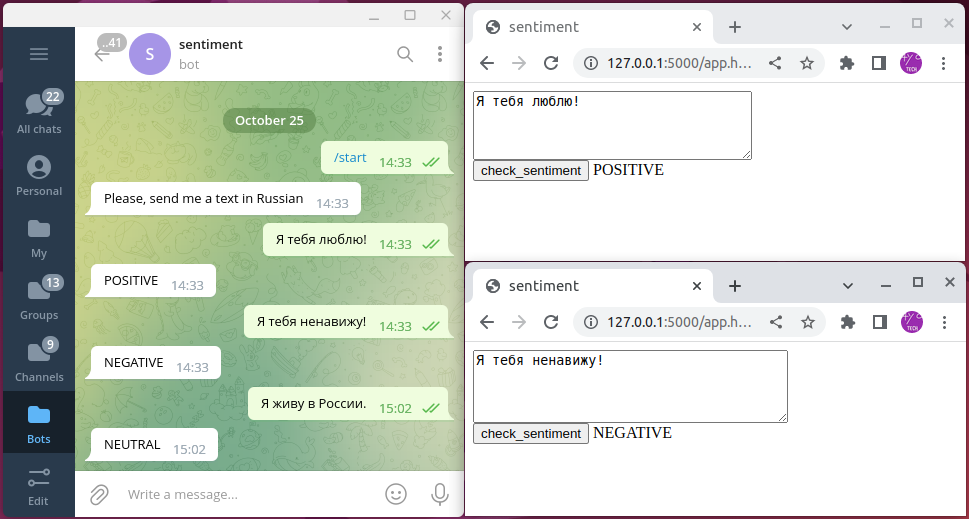

В данном проекте используется предобученная модель для классификации тональности текста на русском языке (https://huggingface.co/Tatyana/rubert-base-cased-sentiment-new). Сервис состоит из 3х docker-контейнеров, объединенных в общую сеть. В одном из контейнеров работает сама модель (используется tensorflow-serving), оставшиеся 2а - веб-сервис и телеграм бот, использующие модель для предсказаний.

#### Загрузка файлов проекта
```bash
git clone https://github.com/vaaliferov/sentiment && cd sentiment
```

#### Загрузка и конвертация модели
Для загрузки и конвертации модели в формат tensorflow-serving, необходимо выполнить нижеуказанные команды. Файлы модели будут сохранены в директорию model. По завершении, установленные пакеты можно удалить.
```bash
pip3 install torch tensorflow transformers
python3 save_model.py
```

#### Конфигурация бота
Необходимо переименовать файл `_secret_.py` в `secret.py` (директория bot) и указать в этом файле id пользователя (которому будут приходить уведомления об активности бота) а также токен самого бота. Создать бота, узнать его токен, а также узнать id пользователя можно с помощью @BotFather и @userinfobot.

#### Установка docker
```bash
sudo apt install docker.io
sudo apt install docker-compose
```
```bash
sudo groupadd docker
sudo usermod -aG docker ${USER}
sudo systemctl restart docker
sudo chmod 666 /var/run/docker
```

#### Сборка контейнеров
```bash
docker-compose build
```

#### Запуск и остановка сервиса
```bash
docker-compose up -d
docker-compose down
```


